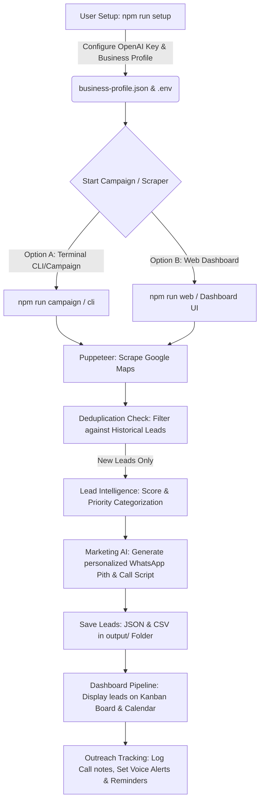

# Business Leads AI Automation - Project Flow & Overview

Yeh document is project ke flow, design aur functions ko Roman Urdu aur English mixing ke sath detail se explain karta hai taake naye developers ya users isko aasani se samajh sakein.

---

## 🚀 1. Project Overview (Project Kya Kr Raha Hai?)

Yeh project aik **B2B Lead Generation and Cold Outreach Automation** tool hai. Iska main maqsad local businesses (jaise Clinics, Restaurants, Schools, software houses, etc.) ka public data Google Maps aur directories se scrape karna hai, un leads ki quality ko AI ke through score karna hai, aur automatic marketing pitches (WhatsApp messages & call scripts) generate karna hai.

### Key Capabilities:
1. **Google Maps Scraping**: Puppeteer ke zariye automation search, scrolling aur data extraction (Name, Address, Phone, Website, Rating, Maps Link).
2. **Lead Deduplication**: Purani campaigns ke names, phone suffixes aur websites check kar ke repeat campaigns mein duplicate data skip karna.
3. **AI Lead Scoring (Disabled)**: Pehle lead quality score logic active thi, jo ab user requirement ke mutabiq disabled hai taake koi lead skip na ho.
4. **AI Outreach Engine**: OpenAI GPT (`gpt-4o-mini`) ka use kar ke custom Call Scripts aur WhatsApp marketing templates Roman Urdu aur English mein generate karna (according to your Business Profile).
5. **Interactive Web Dashboard**: Express.js web server jo campaigns, visual Kanban pipeline, follow-up calendar, text-to-speech voice reminders, and activity logs display karta hai.

---

## 🔄 2. Main System Flow (Kaam Kaise Karta Hai?)

Neeche is system ka end-to-end flow dia gaya hai:



### Detailed Flow Steps:

### Step 1: Initialization & Configurations
*   **Setup**: User run karta hai `npm run setup`. Yeh terminal script `src/setup.js` run karta hai jo user se OpenAI API keys aur Business Profile details leta hai (Services offered, value propositions, pricing, etc.) aur unhe `.env` aur `business-profile.json` mein save karta hai.
*   **Centralized Profile**: `src/businessProfile.js` in configurations ko format kar ke poore project mein supply karta hai.

### Step 2: Campaign Triggering
User do tareeqon se tool use kar sakta hai:
1.  **CLI / Terminal**: Direct node scripts se ya interactive menu command `npm run campaign` se.
2.  **Web Dashboard**: `npm run web` se Express server chala ke browser dashboard par campaign create karke.

### Step 3: Puppeteer Scraping & Intelligent Deduplication
*   `src/scraper.js` browser launch karta hai (headless mode mein) aur Google Maps URL (`https://www.google.com/maps/search/<query>`) open karta hai.
*   **Dynamic Scroll Loop (Anti-Duplication)**: Agar purani campaigns mein kuch leads pehle se scraped hon, to scraper automatic scroll depth barha deta hai (depth looping). Yeh tab tak deep scroll karta rehta hai jab tak usay target limit (e.g. 20) ke barabar **bilkul naye aur unique leads** nahi mil jatay, ya maps results khatam nahi ho jatay.
*   **Deduplication**: Naye leads ko purani files (`output/` mein mojood JSON history) ke business name, phone number (last 9 digits suffix), aur website ke sath compare kar ke unique list filter out ki jati hai.

### Step 4: Lead Scoring Bypassed (Disabled)
*   `src/leadIntelligence.js` lead scoring logic ko ab user request ke mutabiq bypass (disable) kar dia gaya hai.
*   Ab har lead ko automatic:
    *   **Score**: `100` (Excellent)
    *   **Priority**: `'HIGH'`
    *   **Category**: `'A+ (Excellent)'`
    assign hota hai taake dynamic marketing generation mein kisi bhi lead ko low quality keh kar filter/skip ya limit na kia jaye. Sab prospects ko outreach pitch milti hai.

### Step 5: AI Outreach Generation
*   `src/marketingAI.js` OpenAI model se connect hota hai.
*   Har lead ke liye local Pakistani market context aur industry templates (Pain points, Solutions, Benefits) ka use kar ke custom Call Script aur WhatsApp outreach pitch generate ki jati hai.
*   Pitches Roman Urdu ya English standard preference ke mutabiq banai jati hain (jaise: *"Aoa, kya mein dental clinic owner se baat kar sakta hu..."*).

### Step 6: Visual Pipeline & Dashboard Actions
*   Leads `output/` folder mein unique JSON & CSV files mein save hotay hain.
*   Web server `src/web/server.js` dynamic UI load karta hai.
*   Web UI par leads **Visual Kanban Pipeline** board par visible hote hain (`New`, `Contacted`, `Meeting Scheduled`, `Proposal Sent`, `Closed Won`, `Closed Lost`).
*   Aap har lead par double click kar ke **Call Logs & Outreach history** add kar sakte hain.
*   Aap **Follow-up reminder calendar** use kar sakte hain jo visual scheduling ke sath browser vocal reminders alert generate karta hai.

---

## 📂 3. Code Directory & Core Modules Map

| Path & File | Function / Role |
| :--- | :--- |
| **`index.js`** | Root file jo program ko target command (CLI execution `/src/cli.js`) par forward karti hai. |
| **`src/setup.js`** | Setup Wizard command line configuration script. |
| **`src/cli.js`** | Command Line arguments parsing aur basic CLI flow setup. |
| **`src/scraper.js`** | Puppeteer extraction code (Google Maps navigation, parsing & deduplication logic). |
| **`src/fileUtils.js`** | Leads load/save functions, file formatting, phone formatter (Pakistani phone normalizer). |
| **`src/leadIntelligence.js`**| Leads evaluate & classification scoring algorithm. |
| **`src/marketingAI.js`** | Core Prompt engineer jo OpenAI GPT ko call kar ke pitches banata hai. |
| **`src/marketing.js`** | Simulated email/whatsapp and utility marketing workflow executor. |
| **`src/businessProfile.js`**| Business profiles information settings loader. |
| **`src/openaiClient.js`** | Central client connection helper for OpenAI API setup. |
| **`src/web/server.js`** | REST APIs endpoints loader for dashboard and frontend rendering. |

---

## 🛠️ 4. Project Start Commands

Aap is project ke useful scripts packages.json ke mutabiq chalane ke liye follow karein:

*   **Project Setup**:
    ```bash
    npm run setup
    ```
*   **Run CLI Campaigns**:
    ```bash
    npm run campaign
    ```
*   **Run Web Dashboard Dev Mode**:
    ```bash
    npm run web:dev
    ```
*   **Run Direct CLI Scrape**:
    ```bash
    node index.js -q "Schools in Rawalpindi" -l 10
    ```
